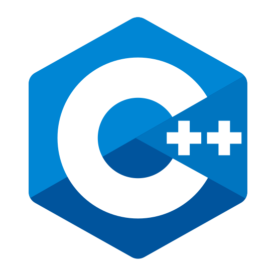

# 😃 Hello, I'm Ujjwal Raut 👋

&nbsp;&nbsp;&nbsp;&nbsp;
&nbsp;&nbsp;&nbsp;&nbsp;
&nbsp;&nbsp;&nbsp;&nbsp;

 

***

## 🏢 I'm a Lead Programmer at [GameEon Studios](https://gameeon.in/), a creative game development and publishing company based in Mumbai, India.

***

### 👔 <ins>About Me:</ins>

- 🔭 I'm currently working on [Ghost-Engine](https://github.com/CybernetHacker14/Ghost-Engine)
- 🌱 I'm currently practising C++, OpenGL and game engine programming
- 💻 Interested in game development, graphics and game engine programming as well as modding
- 🔷 My Sims 4 [mods](https://modthesims.info/m/8469309)
- 🔫 My Counter Strike : Global Offensive SourceMod [scripts](https://github.com/CybernetHacker14/SourceScripts)

***

### 🔧 <ins>Languages and Tools:</ins>

&nbsp;&nbsp;&nbsp;&nbsp;
&nbsp;&nbsp;&nbsp;&nbsp;
&nbsp;&nbsp;&nbsp;&nbsp;
&nbsp;&nbsp;&nbsp;&nbsp;
&nbsp;&nbsp;&nbsp;&nbsp;
&nbsp;&nbsp;&nbsp;&nbsp;
&nbsp;&nbsp;&nbsp;&nbsp;

***

### :octocat: <ins>Github:</ins>

### ✨ <ins>Favourite Projects:</ins>

 

