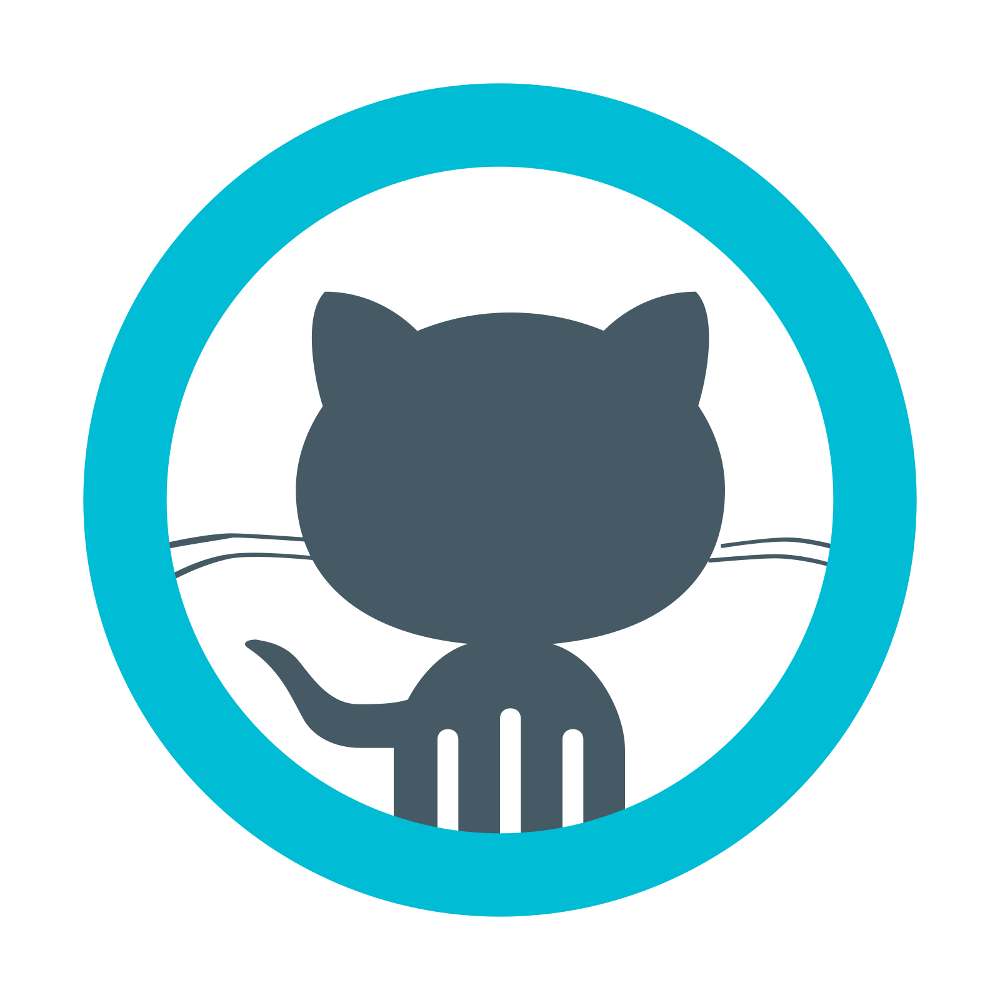
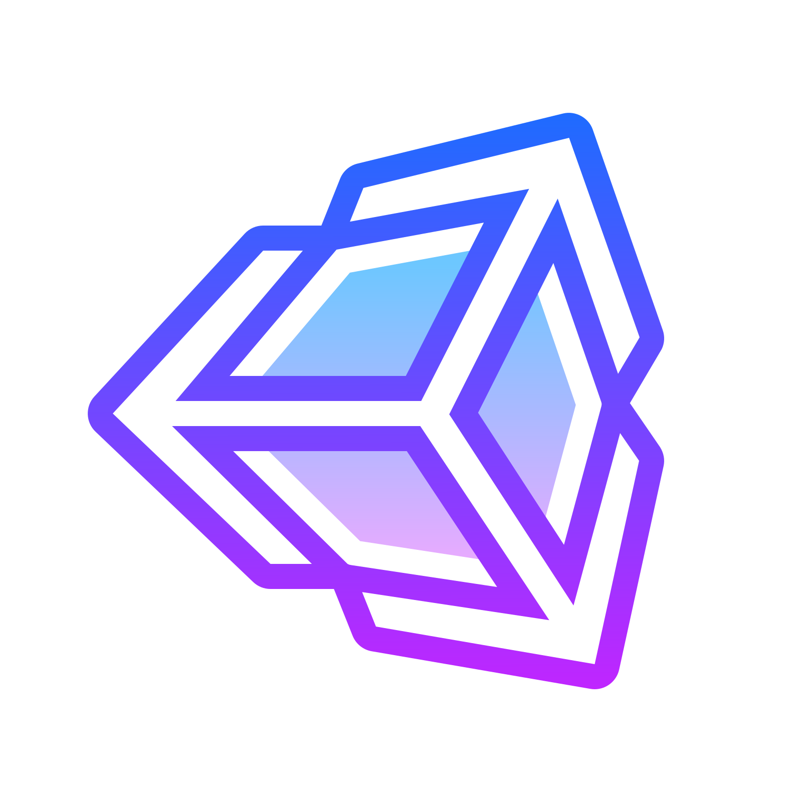
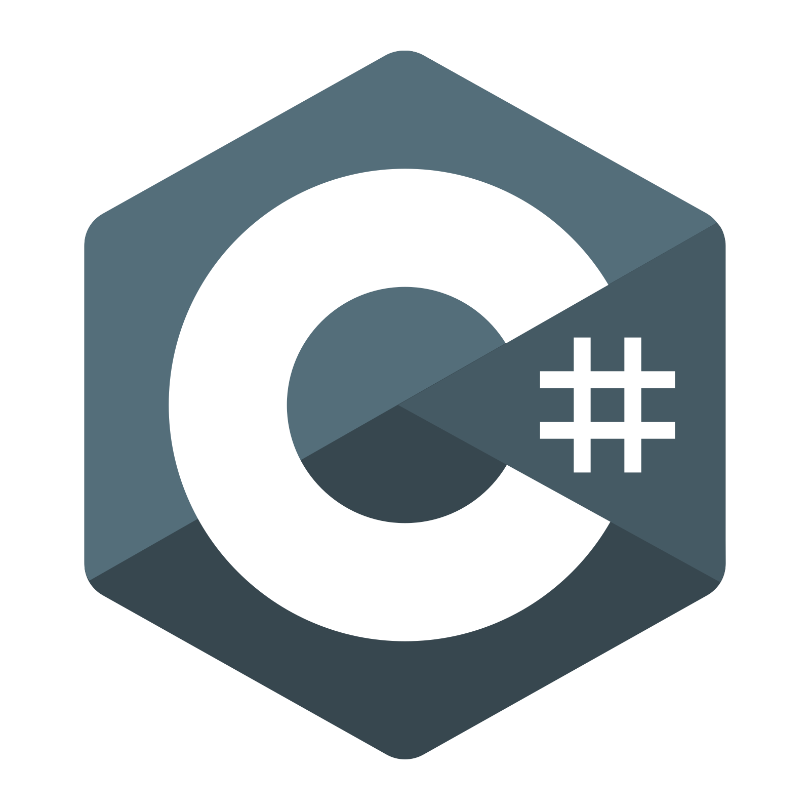
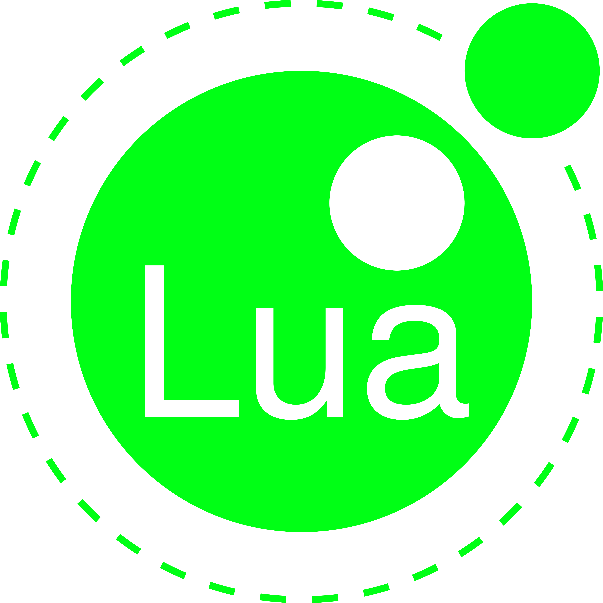
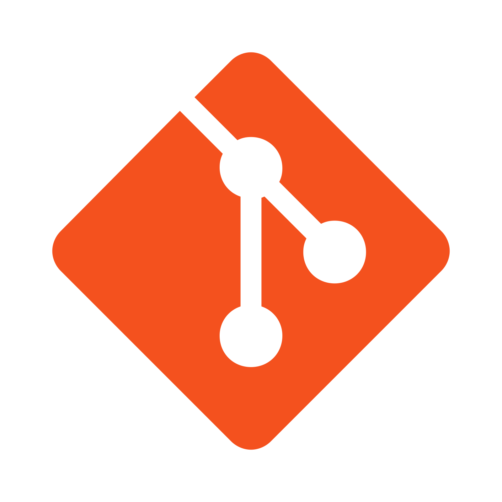

<table>
  <tr>
    <td></td>
    <td>
      <h1>
      <p align = "center">
      😃 Hello, I'm Ujjwal Raut 
      </p>
      </h1>
      <p align = "center">
        
      </p>
      <p align = "center">
      <a href="https://www.linkedin.com/in/ujjwal-raut-cybernethacker14/">
        
      </a>&nbsp;&nbsp;&nbsp;&nbsp;
      <a href="https://github.com/CybernetHacker14/">
        
      </a>&nbsp;&nbsp;&nbsp;&nbsp;
      <a href="https://cybernethacker14.artstation.com/">
        
      </a>&nbsp;&nbsp;&nbsp;&nbsp;
      <a href="mailto:ujjwalraut.14@gmail.com">
        
      </a>&nbsp;&nbsp;&nbsp;&nbsp;
      
      </p>
    </td>
  </tr>
</table>


## 🏢 I'm a Graphics Programmer at [Sony India](https://www.sonyindiasoftware.co.in/), working with engineers on next generation technologies.


### 👔 <ins>About Me:</ins>

<table>
  <tr>
    <td>
      <ul>
        <li>🔭 Currently working on <a href="https://github.com/CybernetHacker14/Sentinel">Sentinel</a> and <a href="https://github.com/CybernetHacker14/PACT">P.A.C.T.</a></li>
        <li>🌱 I'm currently practising C++, DirectX 11 and game engine programming</li>
        <li>💻 Interested in game development, graphics and game engine programming as well as modding</li>
        <li>:video_game: Check out my personal <a href="https://github.com/CybernetHacker14/game-mods">video game mods</a></li>
      </ul>
    </td>
  </tr>
</table>


###  <ins>Github Info:</ins>

<table>
  <tr>
    <td>
      <p align = "center">
        <a href = "https://github.com/CybernetHacker14">
          
        </a>
      </p>
    </td>
  </tr>
  <tr>
    <td>
      <p align = "center">
        <a href = "https://github.com/CybernetHacker14">
          
        </a>
      </p>
    </td>
  </tr>
</table>


###  <ins>Github Stats:</ins>

<p align = "left">
  <a href = "https://github.com/CybernetHacker14">
    
    </a>&nbsp;&nbsp;&nbsp;&nbsp;&nbsp;&nbsp;&nbsp;&nbsp;
    
</p>


### 🔧 <ins>Skills:</ins>

<table>
  <tr>
    <td>
      <p>
      <table>
        <tr>
          <th><center>Programs</center></th>
          <td>
            &nbsp;&nbsp;&nbsp;&nbsp;
            &nbsp;&nbsp;&nbsp;&nbsp;
            &nbsp;&nbsp;&nbsp;&nbsp;
            &nbsp;&nbsp;&nbsp;&nbsp;
            &nbsp;&nbsp;&nbsp;&nbsp;
          </td>
        </tr>
        <tr>
          <th><center>Languages</center></th>
          <td>
            &nbsp;&nbsp;&nbsp;&nbsp;
            &nbsp;&nbsp;&nbsp;&nbsp;
            &nbsp;&nbsp;&nbsp;&nbsp;
            &nbsp;&nbsp;&nbsp;&nbsp;
            &nbsp;&nbsp;&nbsp;&nbsp;
          </td>
        </tr>
        <tr>
          <th><center>APIs</center></th>
          <td>
            &nbsp;&nbsp;&nbsp;&nbsp;
            &nbsp;&nbsp;&nbsp;&nbsp;
          </td>
        </tr>
        <tr>
          <th><center>Utilities</center></th>
          <td>
            &nbsp;&nbsp;&nbsp;&nbsp;
            &nbsp;&nbsp;&nbsp;&nbsp;
            &nbsp;&nbsp;&nbsp;&nbsp;
          </td>
        </tr>
      </table>
      </p>
    </td>
    <td>
      <br/>
      <p align = "center">
        <a href = "https://github.com/CybernetHacker14">
          
        </a>
      </p>
    </td>
  </tr>
  <tr>
    <td>
      <p align = "center">
        <a href = "https://github.com/CybernetHacker14">
          
        </a>
      </p>
    </td>
    <td>
      <p align = "center">
        <a href = "https://github.com/CybernetHacker14">
          
        </a>
      </p>
    </td>
  </tr>
</table>


### ✨ <ins>Featured Projects:</ins>

<table>
  <tr>
    <td>
      <p align = center>
        <a href = "https://github.com/CybernetHacker14/Sentinel">
          
        </a>
      </p>
    </td>
    <td>
      <p align = center>
        <a href = "https://github.com/CybernetHacker14/PACT">
          
        </a>
      </p>
    </td>
  </tr>
  <tr>
    <td>
      <p align = center>
        <a href = "https://github.com/CybernetHacker14/Ghost-Engine">
          
        </a>
      </p>
    </td>
    <td>
      <p align = center>
        <a href = "https://github.com/CybernetHacker14/game-mods">
        
        </a>
      </p>
    </td>
  </tr>
</table>


### :thought_balloon: <ins>Random gaming quote:</ins>

```
Wanting something does not give you the right to have it

- Ezio Auditore da Firenze, Assassin's Creed II
```
